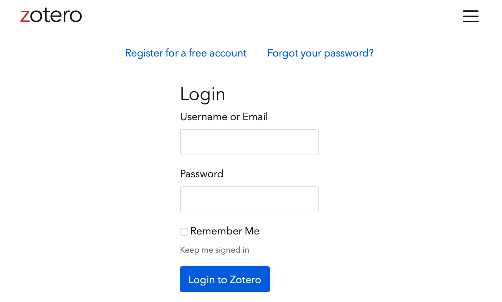
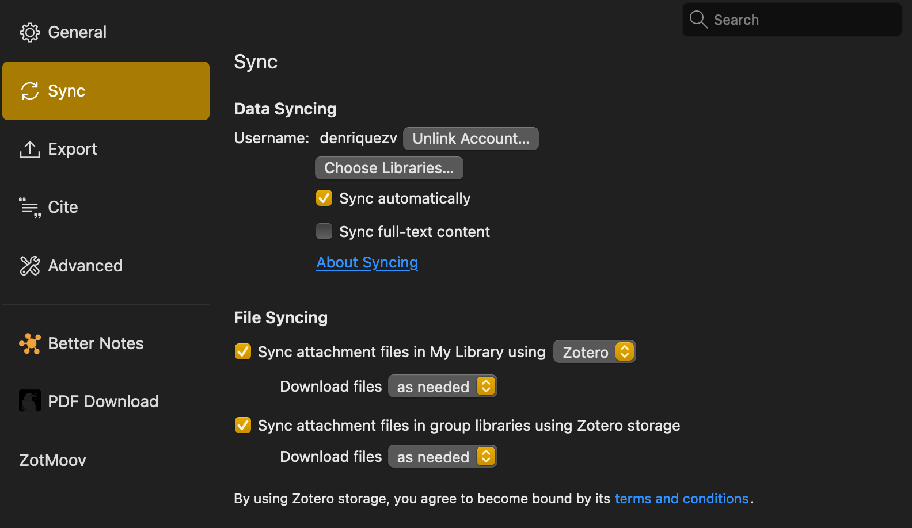
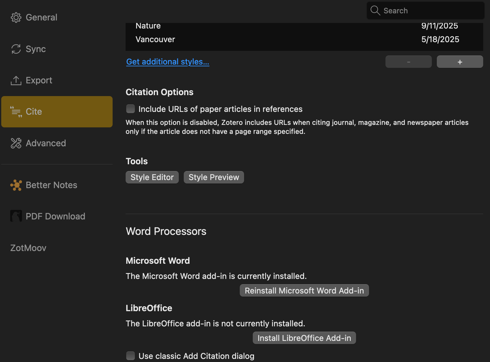

# Zotero

Zotero es un software de código libre (gratuito), muy versátil y con funciones especiales (Ejemplo: sincronización en la nube, notas, sincronización con otras aplicaciones).

::: {.callout-note collapse="true"}
## Zotero puede descargar automáticamente tus artículos

Zotero tiene incluido a [Unpaywall](https://www.zotero.org/blog/improved-pdf-retrieval-with-unpaywall-integration/). Unpaywall es una iniciativa para encontrar y descargar articulos disponibles en PDF (evita tener que estar descargando PDFs).
:::

## Crearse una cuenta e instalar Zotero

Mi recomendación es:

A)  Crear una cuenta:

::: {.callout-note collapse="true" icon="false"}
## Register for a free account

:::

B)  Ingresar al siguiente link: [*Zotero*](https://www.zotero.org/download/) para descargar según el sistema operativo que tengas en tu computadora.

C)  (Adicional) Instalar **Zotero connector** (Preferencia: como extensión en Google Chrome).

## Iniciar sesión en Zotero

Una vez instalado Zotero en tu sistema operativo, es necesario iniciar sesión: `Settings > Sync`

::: {.callout-note collapse="true" icon="false"}
## Iniciando sesión para una mejor integración

:::

## Instalar extensión (**add-ons or plugins**) para integración con MS Word.

::: {.callout-note collapse="true" icon="false"}
## Integración con MSWord

:::

* Adicionalmente: instalar Notero, Zotfile, Better bibtex, etc.

### 4. Configurar Zotero (para lograr sincronización en la nube)

En la barra de menú, ir a **Edit**, luego a **Preferences**.

-   En la ventana de **Zotero Preferences**, ir a la pestaña General. **Uncheck** la primera opción de **File Handling** (tomar capturas de pantalla automáticas cuando crea items de páginas web)

-   En la pestaña **Sync**, desactivar la opción **Sync full-text content**.

-   En la pestaña **Export**, usaremos **Vancouver**. (Podemos usar el atajo Control+Shift+C).

-   En la pestaña **Cite**, entraremos a la sub-pestaña **Word Processors** para instalar el Microsoft Word Add-in

    -   Previo a este paso debemos seleccionar o asignar una carpeta para Zotero. Este directorio tendrá dos sub-carpetas (Una para sincronización y la otra para archivos propios del sistema Zotero).En mi caso he creado la carpeta en la unidad D, BibZot, y Dentro dos carpetas ZotSync y ZotSys.

-   En la Pestaña **Advanced** (La parte más importante), iremos a la sub-pestaña **Files and Folders**.

    -   En el cuadro **Linked Attachment Base Directory**, haciendo clic en **choose**, elegiremos la dirección de la carpeta donde se guardaran nuestros archivos sincronizados.

    -   en mi caso **ZotSync** (Esta carpeta estará sincronizada luego con Google Drive, OneDrive o Cloud).

    -   En el cuadro **Data Directory Location**, haciendo clic en **Custom**, colocaremos la ubicación de la carpeta para archivos del sistema de Zotero.

    -   en mi caso **ZotSys**. (NO SINCRONIZAR ESTA CARPETA CON NINGUN SOFTWARE)

-   En la pestaña *Better BibTeX*, al hacer clic nos aparece una nueva ventana. En el cuadro **Citation Keys** colocaremos el **Citation key format**:

    > \[auth.lower\]\[year\]\[journal:lower:abbr\]

Luego dejaremos el resto de configuraciones por *default*.

### 5. Configurar Zotfile

Zotfile renombrará los archivos por reglas predefinidas y creará una base de datos ordenada y jerárquica.

En la barra de menú, ir a **Tools**, luego a **ZotFile Preferences**.

-   En la pestaña **General Settings** hay dos cuadros con direcciones:

    -   **Source Folder for Attaching New Files**: Zotfile subirá automáticamente todos los archivos que se descarguen en esta carpeta. En mi caso he creado una carpeta adicional en Descargas

    -   **Location of Files**: Luego de seleccionar **Custom Location**, colocaremos la direccion de nuestra carpeta destinada para sincronización **ZotSync**. Luego marcaremos **Use Subfolder defined by** y escribiremos **/%a** (Esto creara carpetas por nombres de autor)

    -   **Tablet Settings**: Aún no he explorado esta función.

    -   **Renaming Rules**: verificaremos que **Use Zotero to Rename** está desmarcado. Luego, usaremos la configuración por **default**({%a\_}{%y\_}{%t}).

    -   En Additional Settings: Marcaremos solo **Change to lower case**, **Replace Blanks**, **Maximum length of title 80**, y **Maximum number of authors**.

    -   Advanced Settings: en **Other Advanced Settings**, seleccionaremos **Always rename**, en la opción **Automatically rename new attachments**

### 6. Notas

Si se realiza algún cambio manual se debe cambiar el nombre usando ZotFile (Manage Attachments -\> Rename Attachments) Eliminar Zotero System/storafe

References: https://ikashnitsky.phd/2019/zotero/