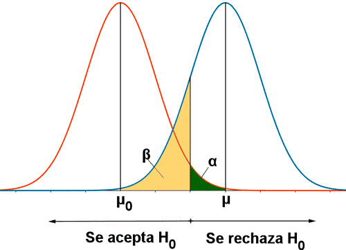

# Cálculo Muestral

::: {.callout-note collapse="true" icon="💻"}
## ¿Por qué es necesario una muestra?

-   Para rechazar nuestra hipótesis nula no es necesario colectar toda la población (tiempo, dinero y recursos)
-   Puede ser antiético.
:::

::: {.callout-note collapse="true" icon="💻"}
## Resumen de Funciones en ***pwr***

| **Test** | **Función** |
|------------------------------------|------------------------------------|
| 1 muestra, 2 muestras independientes, 2 muestras pareadas (t-test) | pwr.t.test() |
| 2-muestras t-tests (unequal sample sizes) | pwr.t2n.test() |
| 2-muestras proportion test (unequal sample sizes) | pwr.2p2n.test() |
| 1-muestra, proporciones | pwr.p.test() |
| 2-muestras, proporciones | pwr.2p.test() |
| 2-muestras, proporciones(diferentes tamaños muestrales) | pwr.2p2n.test() |
| one-way balanced ANOVA | pwr.anova.test() |
| Prueba de Correlación | pwr.r.test() |
| Chi-cuadrado (Bonda de Ajuste y Asociación) | pwr.chisq.test() |
| Modelo Lineal Generalizado | pwr.f2.test() |
:::

## 1. Muestra para Proporciones (1 grupo): Estudios transversales (prevalencias, encuestas)

-   Caso 1: La prevalencia de infección por Strongyloides es del 12% en el Perú, sin embargo, un estudio tiene como hipótesis que la prevalencia de Strongyloides en regiones rurales es mayor al 20%. ¿Cuántas personas de zonas rurales se necesitan para demostrar la hipótesis?

::: {.callout-tip collapse="true"}
## Análisis

-   Hipótesis nula: La prevalencia de infección por Strongyloides es 12%.
-   Hipótesis alterna: La prevalencia de infección por Strongyloides en zonas rurales es 20%.

```{r}
pacman::p_load(pwr)
pwr.p.test(h = ES.h(p1 = 0.20, p2 = 0.12),
           n = NULL,
           sig.level = 0.05,
           power = 0.80,
           alternative = "greater")
```
:::

::: {.callout-note collapse="true"}
## Nivel de Significancia y Poder (*sig.level, power*)



Sí solo evaluamos un incremento o disminución, se puede utilizar solo a una cola (alfa).

:::

## 2. Muestra para Proporciones (2 grupos): Estudios analíticos

En un estudio queremos comparar la frecuencia de hipersomnio en alumnos con o sin uso de redes sociales mayor a 6horas al día. Se estima que la frecuencia de insomnio en alumnos con uso de redes sociales mayor a 6h es de 30%, mientras que en alumnos sin uso de redes sociales es del 10% (basado en una Tesis de la universidad). ¿Cuántos alumnos se necesitan por grupo?

::: {.callout-tip collapse="true"}
## Análisis

-   Hipótesis nula: La frecuencia de alumnos con insomnio no es mayor (o <20%) entre los que usan redes sociales por más de 6h.
-   Hipótesis alterna: La frecuencia de alumnos con insomnio es mayor (o <20%) entre los que usan redes sociales por más de 6h.

```{r}
pacman::p_load(pwr)
pwr.2p.test(h = ES.h(p1 = 0.30, p2 = 0.10),
           n = NULL,
           sig.level = 0.05,
           power = 0.80,
           alternative = "two.sided")

## En caso ambos grupos puedan tener participantes diferentes
pwr.2p2n.test(h = ES.h(p1 = 0.30, p2 = 0.10),
           n1 = 80,
           sig.level = 0.05,
           power = 0.80,
           alternative = "two.sided")
```
:::
