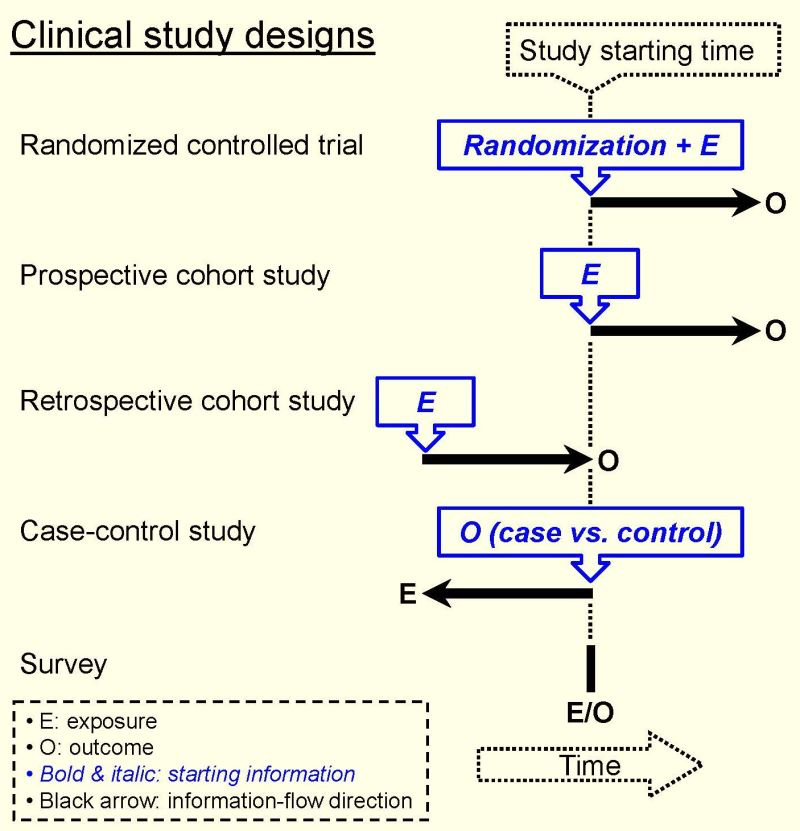

La mayoría de artículos incluye: - EXPOSURE (Intervention, factor)\*\* - OUTCOME (disease onset)\* - POPULATION\*\* - DESIGN (Lancet \> NEJM)

-   “How to Read a Paper: The Basics of Evidence-Based Healthcare” 7th edition
-   Trisha Greenhalgh & Paul Dijkstra
-   John Wiley & Sons Ltd, 2025
-   Page 30, i.e., the first page of Chapter 3 “Getting your bearings: what is this paper about?”

## Critical Structure

-   Introduction: 3 paragraphs

-   Methods: 10 paragraphs

-   Results: 9 paragraphs

-   Discussion: 8 paragraphs

-   3 tables, 2 figures, 33 references

-   “Empirical analysis of the text structure of original research articles in medical journals”

-   Heßler N, Rottmann M, Ziegler A.

-   PLoS ONE 15(10): e0240288, 2020.

Storytelling: - “Point of View: Tell me a story” - Joshua R Sanes - Elife 8, e50527, 2019

Structure of scientific papers. The current standard is IMRAD (Introduction, Methods, Results and Discussion).

PICOTTT Patient Intervention Comparison Outcome Time Type of question Type of study

\- “How to construct a Nature summary paragraph”\
- Direct link: <https://lnkd.in/gKZP3qDJ>

1.  Broad background information
2.  Narrow background information
3.  Problem to be addressed
4.  Summary of main results
5.  Methods (Absent)
6.  Main results
7.  Summary with interpretations
8.  Broader interpretations

### 1st paragraph:

Key hypothesis is generated

A candidate mechanism is proposed

Hypothesis proved to be true

General statement

Focused statement

Hypothesis