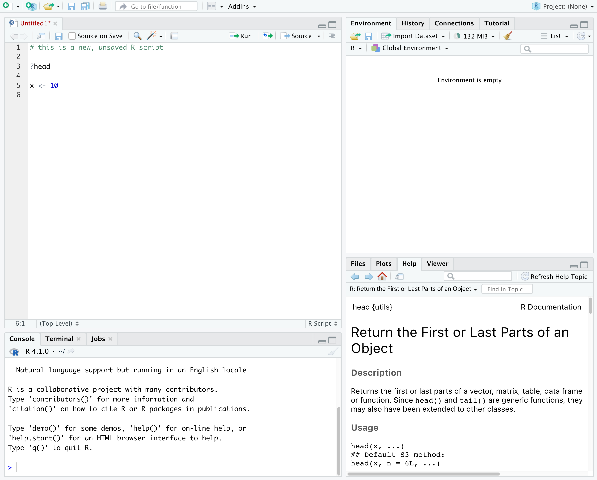
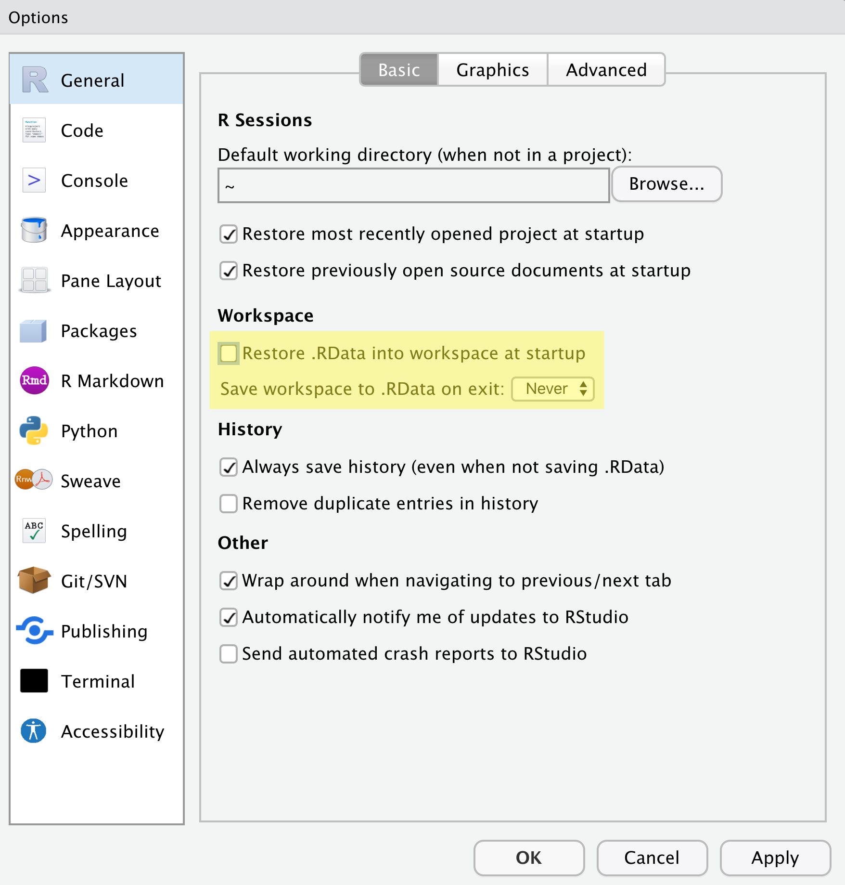

# Introducción a R y Rstudio

::: callout-important
## Importante

**R y Rstudio NO es lo mismo.**

R es el lenguaje de programación -\> Rstudio es un tipo de interfaz para R (*integrated development environment* o IDE)
:::

## 1. Instalación

::: {.callout-note collapse="true"}
## R y Rstudio para Windows

**R**

1.  Ir a [CRAN Website](https://cran.r-project.org/bin/windows/) y hacer clic en [***install R for the first time***](https://cran.r-project.org/bin/windows/base/).
2.  Inmediatamente empezará la descarga (es posible hacerlo también manualmente).
3.  Instalar R.

**Rstudio**

1.  Ir a [Posit Website](https://posit.co/download/rstudio-desktop/#download) y elegir la versión de Rstudio a instalar.
2.  Instalar Rstudio.
:::

::: {.callout-note collapse="true"}
## R y Rstudio para Mac

**R**

1.  Ir a [CRAN Website](https://cran.r-project.org/bin/macosx/) y descargar el instalador(***archivo pkg***).
2.  Instalar R.

**Rstudio**

1.  Ir a [Posit Website](https://posit.co/download/rstudio-desktop/#download) y elegir la versión de Rstudio a instalar.
2.  Instalar Rstudio.
:::

Probar la instalación de Rstudio: presionar `Shift+Cmd+N (Mac)` o `Shift+Ctrl+N (Windows)`para abrir un script en blanco.



## 2. Paquetes

-   R funciona con paquetes que permiten agregar infinidad de funciones.
-   Los paquetes se encuentran disponibles en repositorios de código abierto.
-   Primero instalar -\> luego activar el paquete.

```{r}
#| echo: true
#| eval: false
#| warning: false
#| message: false

# Estructura básica para instalar paquetes (Esto es un comentario, #)
install.packages("NombrePaquete")

# Múltiples paquetes
install.packages(pkgs=c("Pkg1", "Pkg2", "Pkg3"),  
                 dependencies = "Imports")

#Mostrar repositorios
getOption("repos") 
```

Luego de instalar es necesario ***activar*** el paquete a usar.

```{r}
#| echo: true
#| eval: false
#| warning: false
#| message: false

# Activar el paquete previo
library("NombrePaquete")

# Actualizar paquetes
update.packages(ask=FALSE) 
```

::: {.callout-important collapse="true"}
## Instalar desde Github/Bioconductor

-   Es necesario tener `devtools` para instalar desde Github.

```{r}
#| echo: true
#| eval: false
#| warning: false
#| message: false

if(! "devtools" %in% installed.packages())   
  {install.packages("devtools")}
devtools::install_github("paquete_de_github")
```

-   Bioconductor: Análisis de data genómica

```{r}
#| echo: true
#| eval: false
#| warning: false
#| message: false

#Biocmanager
if (!requireNamespace("BiocManager"))   
  install.packages("BiocManager")
BiocManager::install(pkgs=c("pkg1", "pkg2"))
BiocManager::install() #Actualizar paquetes

```
:::

## 3. Trabajando en R

Es mejor trabajar siempre creando proyectos independientes para asegurar que sea reproducible. Adicionalmente, es necesario mantener una configuración básica:



### 3.1 Directorio de Trabajo ~(wd,\ working\ directory)~

-   Dirección o ubicación (carpeta o folder) para importar/exportar/cargar/guardar archivos.
  
::: {.callout-tip collapse="true"}
## Tip

*Evitar espacios, tildes o carácteres en el nombre.*
:::

-   Comandos útiles:

    -   `getwd()`: Cuál es la dirección actual?
    -   `setwd()`: Definir la dirección
    -   `dir()`: Generar una lista de archivos y carpetas en el *wd*.
    -   `ls()`: Genera una lista de objetos abiertos en R.
    -   `file.choose()`

::: {.callout-note collapse="true"}
## Ejemplo N1

Los comentarios dentro del código son incluidos con `#`.
```{r}
#| echo: true
#| eval: false
#| warning: false
#| message: false

#Ejemplo en MacOS, en Windows "C:/Docum..")
setwd("/Users/denriquez/Documents/Rstats/RepoGit/R-estudiantes") 
#Comprobar el wd
getwd()  
#Lista de archivos en wd
dir()

```

:::


### 3.2 Objetos

En R, toda información o data está guardada en objetos. Por lo tanto, cada `Función` trabaja con un tipo específico de `Objetos` `getClassDef`.

Tipos de Objetos:

-   **Vectores:** números, carácteres, fórmulas.

-   **Matrices:** varias columnas del mismo tipo y longitud.

-   ***Arrays:*** como Matrices pero con más dimensiones.

-   ***Data frames:*** clásica base de datos con columnas de diferentes tipos.

-   **Listas:** lista de objetos de diferente tipo.

-   **Factores:** Un vector con niveles.

-   **Obj. Avanzados:** S3, S4 (Listas con información interconectada). Ejemplo: plots o información genética.

### 3.3 Operaciones básicas

-   Crear un vector (`<-` o `=`), concatenar (`c()`) y mostrar resultados. \*para valores repetidos: `rep`


::: {.callout-note collapse="true"}
## Ejemplo N2

```{r}
#| echo: true
#| eval: false
#| warning: false
#| message: false

dev<-c(1,2,3,4,5,6,7,8,9,10)
dev
```
:::

-   Características del objeto:

```{r}
#| echo: true
#| eval: false
#| warning: false
#| message: false

length(dev) #longitud
str(dev) #resumen o estructura
```

-   Otros: `class()`, `mode()`.

### 3.4 Operaciones básicas(II)

::: {.callout-note collapse="true"}
## Ejemplo N3 - Manipular un vector.

```{r}
#| echo: true
#| eval: false
#| warning: false
#| message: false

dev[4] #Seleccionar el 4to elemento
dev[5:8] #Seleccionar del 5to al 8vo elemento.
dev2<-dev[-6] #Eliminar el 6to elemento
dev2 #Mostrar el resultado de la operación anterior
```
:::

::: {.callout-note collapse="true"}
## Ejemplo N4 - Crear una matriz.

```{r}
#| echo: true
#| eval: false
#| warning: false
#| message: false

dev.m<-matrix(data=11:20, nrow=2, ncol=5) #2 filas y 5 columnas
is.matrix(dev.m) # es dev.m una matriz?
dev.m #Mostrar la matriz
dim(dev.m) #dimensiones. (2 x 5)
dev.m[,3] #Mostrar la 3ra columna
dev.m[2,] #Mostrar la 2da fila
dev.m[2,3] #Mostrar un elemento con las coordenadas
```
:::

::: {.callout-note collapse="true"}
## Ejemplo N5 - Manipular una matriz.

```{r}
#| echo: true
#| eval: false
#| warning: false
#| message: false

dev.m[,2:4] #Mostrar valores de las columnas 2 a 4
dev1<-c(dev, dev.m[2,]) #concatenar el vector dev a la fila 2.
dev1
dev1<-c(dev.m[1,]) #reemplazar vector por la fila 1
dev1
rm(dev1) #elimina dev1
dev1<-rep(x=10, each=5) #5 repeticiones del valor 10
dev1[dev1==10]<-"diez" #Operacion logica
dev1
```
:::

::: {.callout-note collapse="true"}
## Ejemplo N6 - Estadísticas Básicas.

```{r}
#| echo: true
#| eval: false
#| warning: false
#| message: false

summary(dev.m) #Estadísticas básicas
```
:::

::: {.callout-note collapse="true"}
## Ejemplo N7 - Manipulación de Columnas

```{r}
#| echo: true
#| eval: false
#| warning: false
#| message: false

colnames(dev.m)<-c("A", "B", "C", "D", "E") #Renombrar columnas
dev.m
dev.m[,c("C","E")] #Extraer dos columnas por su nombre
t(dev.m) #Transponer elementos

```
:::

::: {.callout-note collapse="true"}
## Ejemplo N8 - Operaciones en matrices

```{r}
#| echo: true
#| eval: false
#| warning: false
#| message: false

dev.m2<-matrix(rep(c(1:6)), nrow=6, ncol=6)
diag(dev.m2) #diagonal de la matrix
diag(dev.m2)<-rep(x=c(1,2), times=3)
dev.m2
```
:::

### 3.4 Bases de Datos  ~(DF,\ data\ frame)~

```{r}
#| echo: true
#| eval: false
#| warning: false
#| message: false

#¿Qué tipo de variable tenemos?

dev.m2<-matrix(rep(c(1:6)), nrow=6, ncol=6)
is.matrix(dev.m2)
class(dev.m2)
#Conversión a DF
dev.df<-as.data.frame(dev.m2)
class(dev.df)
dev.df[dev.df==6]<-"NA" #remplazar 6 por NA (not available)
dev.df$V6 #Acceder a la variable o ex-columna 6
```

::: {.callout-tip collapse="true"}
## Limpiar el entorno
```{r}
#| echo: true
#| eval: false
#| warning: false
#| message: false

rm(list=ls()) #limpiar todo el entorno
```
:::


::: {.callout-tip collapse="true"}
## Guardar todos los objetos
```{r}
#| echo: true
#| eval: false
#| warning: false
#| message: false

save(list=ls(), file="prueba.RData") 
#Cargar todos los objetos
load("prueba.RData")
fix() #Editar objetos
rm() #eliminar objetos
```
:::

R incluye un DF de prueba: `iris`

```{r}
#| echo: true
#| eval: true
#| warning: false
#| message: false

summary(iris) #estadísticas básicas
```

## 4. Estadísticas Básicas y Visualización

```{r}
#| echo: true
#| eval: true
#| warning: false
#| message: false

#un boxplot
boxplot(formula=iris$Petal.Length~iris$Species)
```


Estadísticas Básicas

```{r}
#| echo: true
#| eval: true
#| warning: false
#| message: false


#Extraer solo información de una especie
setosa<-iris[which(iris$Species=="setosa"),]
#Correlación entre 'length' y 'width'
cor.test(x=setosa$Sepal.Length, y=setosa$Sepal.Width)
```


::: {.callout-note collapse="true"}
## Ejemplo N9 - Plot correlación entre largo y ancho
```{r}
#| echo: true
#| eval: true
#| warning: false
#| message: false

#Plot correlación entre 'length' y 'width'
plot(x=setosa$Sepal.Length, y=setosa$Sepal.Width, main="Sépalos",  
     xlab="Longitud", ylab="Ancho", pch=16, cex=1, col="blue")
abline(reg=lm(setosa$Sepal.Width~setosa$Sepal.Length), col="red", lwd=2)

```
::: 

::: {.callout-note collapse="true"}
## Ejemplo N10 - Análisis de la Varianza (ANOVA)

Para usar ANOVA es necesario \>2 grupos y distribuciòn normal. Ha: Existen diferencias en el tamaño del sépalo entre las 3 especies.

```{r}
#| echo: true
#| eval: true
#| warning: false
#| message: false

aov(formula=iris[["Sepal.Length"]]~iris[["Species"]])
```
:::